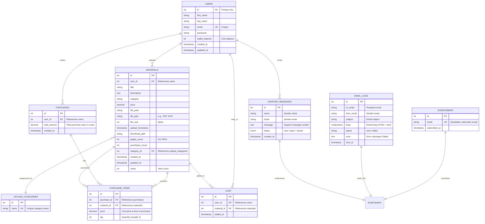

# NoteShare Database ER Diagram

## Database Summary

**Core Tables:**
- **users** - User accounts with wallet balance (coin system)
- **materials** - Study materials (PDFs, documents) uploaded by users
- **upload_categories** - Categories for organizing materials
- **purchases** - Purchase transactions (user buys materials)
- **purchase_items** - Line items in each purchase
- **cart** - Shopping cart for users

**Support & Communication:**
- **support_messages** - Support ticket submissions from users
- **subscribers** - Newsletter subscription emails
- **email_logs** - Audit trail of all sent/failed emails (notifications, newsletters, support)

## Key Relationships

1. **User → Materials** (One-to-Many): Users upload multiple study materials
2. **User → Purchases** (One-to-Many): Users make multiple purchases
3. **User → Cart** (One-to-Many): Users add multiple items to cart
4. **Purchase → Purchase_Items** (One-to-Many): Each purchase has multiple line items
5. **Materials → Purchase_Items** (One-to-Many): Each material can be in multiple purchases
6. **Materials → Upload_Categories** (Many-to-One): Materials belong to a category
7. **User → Support_Messages** (One-to-Many): Users send support tickets

## Wallet System

Users have a `wallet_balance` (integer representing coins):
- Users earn coins by uploading and selling materials
- Users spend coins to purchase materials from other users
- Coin balance is tracked in real-time in the `users` table

## Email System

All emails (newsletters, support notifications, etc.) are:
- Logged in `email_logs` for audit trail
- Tracked with status (sent/failed) and error messages
- Includes full email content (subject, body)
